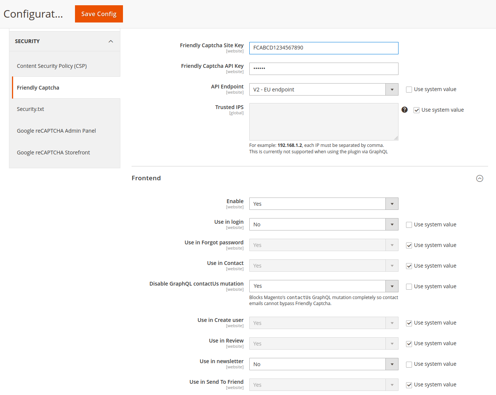

# User Guide

This is the user guide for the official Friendly Captcha Magento 2 module.

## Overview

`IMI_FriendlyCaptcha` adds [Friendly Captcha](https://friendlycaptcha.com/) protection to selected Magento 2 frontend forms.
The extension renders the Friendly Captcha widget on supported forms and validates the submitted response server-side before Magento continues with the request.

This guide covers:

- installation and activation
- Friendly Captcha account setup
- Magento configuration
- a field-by-field explanation of every setting
- testing and troubleshooting

## Requirements

- Magento `>= 2.4.6`
- PHP `>= 8.1`
- outbound server access from Magento to the configured Friendly Captcha verification endpoint

## Supported frontend areas

The extension can protect these Magento storefront areas:

- customer login
- forgot password
- customer registration
- contact form
- product reviews
- newsletter signup
- send to friend

Additionally, the module can disable Magento's `contactUs` GraphQL mutation to prevent that route from bypassing Friendly Captcha.

### Hyva Checkout

There is a Hyva Checkout integration available. Please refer to the [Hyva Checkout Compat Module](https://gitlab.hyva.io/hyva-checkout/checkout-integrations/magento2-hyva-checkout-imi-friendly-captcha) (only for Hyva Checkout subscribers).

## Installation

Install the extension with Composer and enable the Magento module:

```bash
composer require imi/magento2-friendly-captcha
php bin/magento module:enable IMI_FriendlyCaptcha
php bin/magento setup:upgrade
```

If your deployment process requires it, also run:

```bash
php bin/magento cache:flush
```

In production mode you should also redeploy static content and recompile as usual for your environment.

## Friendly Captcha account setup

Before configuring Magento, create the required credentials in Friendly Captcha.

### 1. Create an account

Create or sign in to your Friendly Captcha account:

- Friendly Captcha home: <https://friendlycaptcha.com/>

### 2. Create an application and copy the sitekey

Create an application in the Friendly Captcha dashboard and copy the generated sitekey.

Notes:

- the sitekey is the public key used by the widget in the storefront
- a sitekey typically starts with `FC`
- use the sitekey that belongs to the website or environment you want to protect

### 3. Create an API key and store it securely

Create an API key in the Friendly Captcha dashboard and copy it immediately.

Notes:

- the API key is secret and must be treated like a password
- Friendly Captcha only shows the full API key when it is created
- the Magento module stores this value encrypted in configuration

## Magento configuration path

In the Magento Admin, go to:

`Stores > Configuration > Security > Friendly Captcha`

## Settings screen



## Configuration scopes

The extension uses Magento configuration scopes as follows:

- most activation settings are available on `Default Config` and `Website` scope
- `Site Key`, `API Key`, endpoint settings, and frontend toggles are not configurable per store view
- if you run multiple websites with different Friendly Captcha credentials, configure them at `Website` scope

## Recommended setup order

Use this order for a clean rollout:

1. install and enable the module
2. create the Friendly Captcha application and API key
3. enter the sitekey and API key in Magento
4. choose the correct endpoint
5. enable the module globally
6. enable only the forms you want to protect
7. flush Magento cache
8. test each enabled form from the storefront

## Full settings reference

### General

#### Friendly Captcha Site Key

- Magento path: `imi_friendly_captcha/general/sitekey`
- Scope: `Default` and `Website`
- Required: yes

Enter the Friendly Captcha sitekey from your Friendly Captcha application.

What it does:

- identifies the Friendly Captcha application used by the storefront widget
- is required before the module can become active

If this field is empty, frontend protection stays effectively disabled even if the enable switch is set to `Yes`.

#### Friendly Captcha API Key

- Magento path: `imi_friendly_captcha/general/apikey`
- Scope: `Default` and `Website`
- Required: yes
- Stored encrypted: yes

Enter the Friendly Captcha API key used for server-side verification.

What it does:

- authenticates Magento against the Friendly Captcha verification API
- is required before the module can become active

If this field is empty, frontend protection stays effectively disabled even if the enable switch is set to `Yes`.

#### API Endpoint

- Magento path: `imi_friendly_captcha/general/endpoint`
- Scope: `Default` and `Website`
- Required: yes
- Default: `V1 - Default endpoint`

Available options:

- `V1 - Default endpoint`
- `V1 - EU endpoint`
- `Custom Endpoint`
- `V2 - Default endpoint`
- `V2 - EU endpoint`

What it does:

- defines which Friendly Captcha puzzle endpoint is used by the storefront widget
- defines which verification endpoint Magento calls on form submission
- also determines whether the module uses the v1 or v2 Friendly Captcha frontend assets

Recommendation:

- use a v2 endpoint unless you have a specific reason to stay on v1
- use the EU endpoint if your Friendly Captcha setup and compliance requirements call for EU-hosted endpoints

#### Custom Puzzle Endpoint URL

- Magento path: `imi_friendly_captcha/general/custom_puzzle`
- Scope: `Default` and `Website`
- Required: only when `API Endpoint = Custom Endpoint`

Enter the full URL of the Friendly Captcha puzzle endpoint that should be used by the widget.

This field is validated as a URL and only appears when `Custom Endpoint` is selected.

Use this only when you intentionally need a non-standard endpoint. In most installations, one of the built-in endpoint options is the correct choice.

#### Custom Verify Endpoint URL

- Magento path: `imi_friendly_captcha/general/custom_verify`
- Scope: `Default` and `Website`
- Required: only when `API Endpoint = Custom Endpoint`

Enter the full URL of the Friendly Captcha verification endpoint that Magento should call server-side.

This field is validated as a URL and only appears when `Custom Endpoint` is selected.

#### Trusted IPS

- Magento path: `imi_friendly_captcha/general/trusted_ips`
- Scope: `Default` only
- Required: no

Enter a comma-separated list of IP addresses that should bypass Friendly Captcha.

Example:

```text
192.168.1.2,127.0.0.1
```

What it does:

- disables Friendly Captcha for the listed client IP addresses
- is useful for internal QA, office networks, or trusted upstream systems

Important limitation:

- this bypass is currently not supported for usage through GraphQL

Operational note:

- use this sparingly, because any request coming from those IP addresses will bypass the captcha check

### Frontend

#### Enable

- Magento path: `imi_friendly_captcha/frontend/enabled`
- Scope: `Default` and `Website`
- Default: `No`

This is the master switch for frontend protection.

The module is only effectively active when all three conditions are true:

1. `Enable = Yes`
2. `Friendly Captcha Site Key` is filled
3. `Friendly Captcha API Key` is filled

If either key is missing, the extension behaves as disabled on the frontend.

#### Use in login

- Magento path: `imi_friendly_captcha/frontend/enabled_login`
- Scope: `Default` and `Website`
- Default: `Yes`

Adds Friendly Captcha protection to customer login requests.

This includes the normal customer login flow. The codebase also contains handling for Magento's AJAX login request route.

#### Use in Forgot password

- Magento path: `imi_friendly_captcha/frontend/enabled_forgot`
- Scope: `Default` and `Website`
- Default: `Yes`

Adds Friendly Captcha protection to the customer forgot password submission.

#### Use in Contact

- Magento path: `imi_friendly_captcha/frontend/enabled_contact`
- Scope: `Default` and `Website`
- Default: `Yes`

Adds Friendly Captcha protection to the standard Magento contact form submission.

This protects the normal storefront form post. It does not automatically secure Magento's `contactUs` GraphQL mutation.

#### Disable GraphQL contactUs mutation

- Magento path: `imi_friendly_captcha/frontend/disable_graphql_contact_us_mutation`
- Scope: `Default` and `Website`
- Default: `No`

When enabled, the module blocks Magento's native `contactUs` GraphQL mutation completely.

Why this exists:

- the standard storefront widget flow does not protect that mutation
- if your site exposes GraphQL publicly, the mutation can otherwise bypass the captcha-protected frontend contact form

Use this setting when:

- you do not need the GraphQL `contactUs` mutation
- you prefer a hard block over leaving an unprotected contact route available

Do not enable this blindly if a frontend application, headless storefront, or integration actively depends on `contactUs`.

#### Use in Create user

- Magento path: `imi_friendly_captcha/frontend/enabled_create`
- Scope: `Default` and `Website`
- Default: `Yes`

Adds Friendly Captcha protection to customer account registration.

#### Use in Review

- Magento path: `imi_friendly_captcha/frontend/enabled_review`
- Scope: `Default` and `Website`
- Default: `Yes`

Adds Friendly Captcha protection to product review submission.

#### Use in newsletter

- Magento path: `imi_friendly_captcha/frontend/enabled_newsletter`
- Scope: `Default` and `Website`
- Default: `Yes`

Adds Friendly Captcha protection to Magento's newsletter subscription form.

Implementation note:

- the newsletter widget is rendered globally and then moved into the newsletter form with JavaScript because Magento themes can place that form in different locations

If you are not using Magento's native newsletter subscription feature, disable this setting. Otherwise the widget assets may still be loaded on pages where they are not needed.

#### Use in Send To Friend

- Magento path: `imi_friendly_captcha/frontend/enabled_sendfriend`
- Scope: `Default` and `Website`
- Default: `Yes`

Adds Friendly Captcha protection to Magento's send-to-friend form.

## Endpoint reference

The module ships with these built-in endpoints:

### V1

- Default puzzle: `https://api.friendlycaptcha.com/api/v1/puzzle`
- Default verify: `https://api.friendlycaptcha.com/api/v1/siteverify`
- EU puzzle: `https://eu-api.friendlycaptcha.eu/api/v1/puzzle`
- EU verify: `https://eu-api.friendlycaptcha.eu/api/v1/siteverify`

Official v1 reference:

- <https://developer.friendlycaptcha.com/docs/v1/api/>

### V2

- Default puzzle: `https://global.frcapi.com/api/v2/puzzle`
- Default verify: `https://global.frcapi.com/api/v2/captcha/siteverify`
- EU puzzle: `https://eu.frcapi.com/api/v2/puzzle`
- EU verify: `https://eu.frcapi.com/api/v2/captcha/siteverify`

Official v2 references:

- <https://developer.friendlycaptcha.com/docs/v2/api>
- <https://developer.friendlycaptcha.com/docs/v2/api/siteverify>

## Basic configuration example

For a typical production setup:

- `Friendly Captcha Site Key`: your production sitekey
- `Friendly Captcha API Key`: your production API key
- `API Endpoint`: `V2 - Default endpoint` or `V2 - EU endpoint`
- `Enable`: `Yes`
- enable only the individual forms you actually use
- `Disable GraphQL contactUs mutation`: `Yes` if public GraphQL access exists and you do not need that mutation

## Post-configuration checklist

After saving the configuration:

1. flush Magento caches
2. open each enabled storefront form
3. confirm the Friendly Captcha widget is visible
4. submit a valid request and confirm it succeeds
5. submit without a captcha solution where practical and confirm the request is rejected
6. if using multiple websites, verify each website scope separately

## Testing recommendations

Test at least these cases:

- customer login with captcha enabled
- customer registration with captcha enabled
- forgot password with captcha enabled
- contact form with captcha enabled
- newsletter subscribe if the native Magento newsletter feature is active
- product review submission if reviews are enabled
- send-to-friend if that feature is enabled in your storefront

Also test:

- one trusted IP address, if you use the bypass list
- one non-trusted IP address
- one website scope if credentials differ across websites

## Troubleshooting

### The widget does not appear

Check:

- `Enable` is set to `Yes`
- both `Friendly Captcha Site Key` and `Friendly Captcha API Key` are filled
- the specific form toggle is enabled
- Magento cache has been flushed
- the current website scope contains the expected values

### Newsletter captcha loads on many pages

This can be expected when newsletter protection is enabled, because the module has to support themes where the newsletter form location is not fixed.

If you do not use the native Magento newsletter form, disable `Use in newsletter`.

### Contact form is protected but GraphQL can still submit contact requests

Enable:

`Stores > Configuration > Security > Friendly Captcha > Frontend > Disable GraphQL contactUs mutation`

### Trusted IP bypass is not working for GraphQL

That is a current limitation of the module. The admin configuration already notes that trusted IP support does not apply to GraphQL usage.

## Security and operations notes

- keep API keys separate between environments where possible
- use `Website` scope if different websites need different credentials
- restrict trusted IP bypass entries to narrow, controlled addresses
- review whether `contactUs` over GraphQL should remain available in your environment
- prefer built-in endpoints unless you have a clear operational reason to use custom ones

## Related links

- Friendly Captcha: <https://friendlycaptcha.com/>
- Friendly Captcha developer docs: <https://developer.friendlycaptcha.com/docs/>
- Create a sitekey: <https://developer.friendlycaptcha.com/docs/v2/getting-started/setup>
- Verify responses: <https://developer.friendlycaptcha.com/docs/v2/getting-started/verify>
- API authentication: <https://developer.friendlycaptcha.com/docs/v2/api/authentication>
